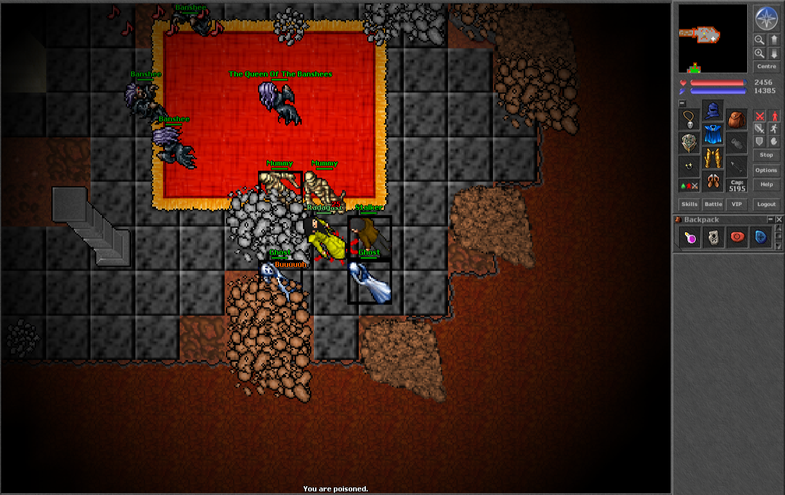
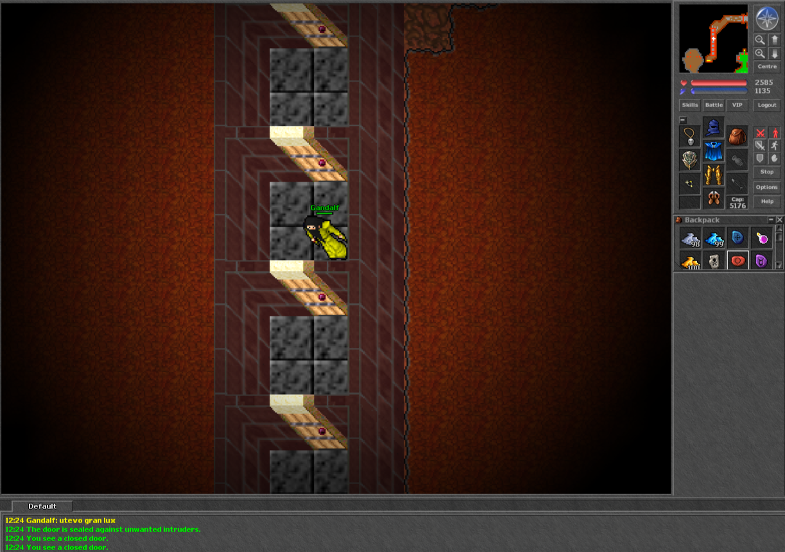
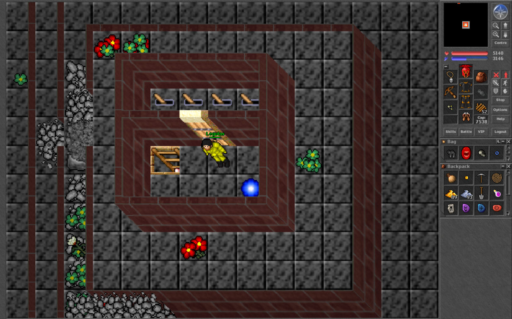
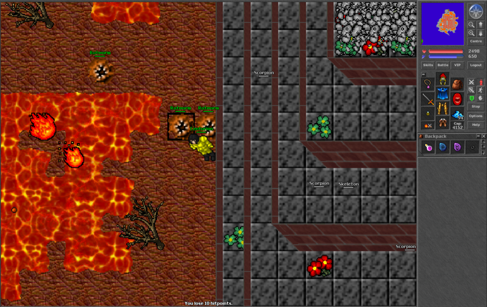
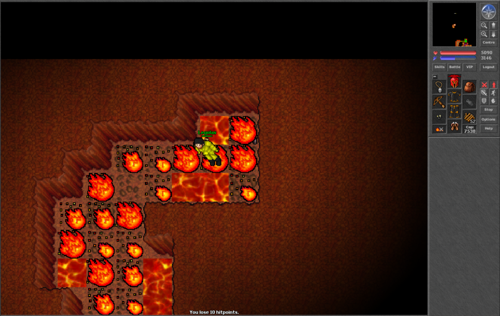
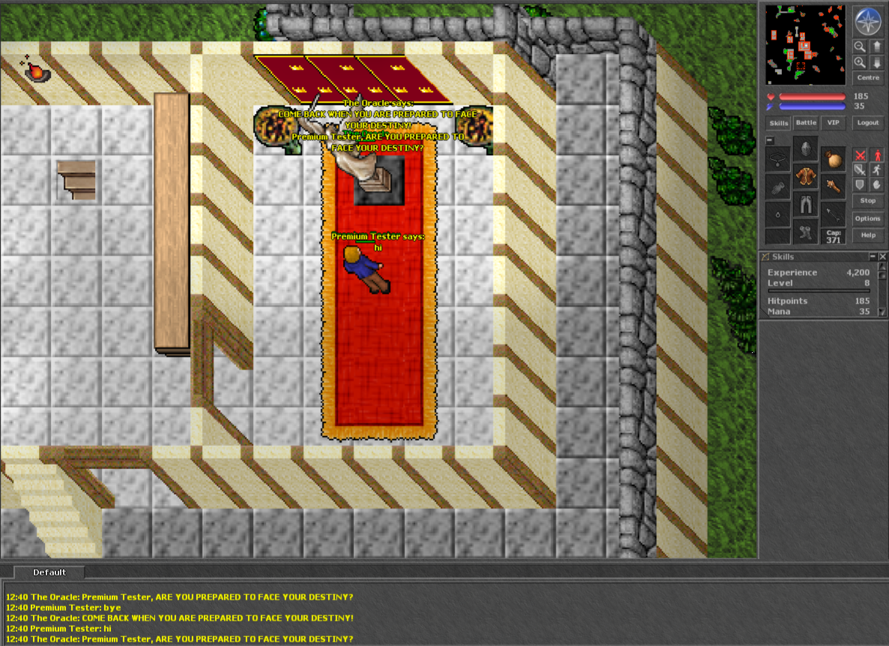

# mintwall

A Tibia 7.4 server that plays like the real game did at the end of 2004, played with the original CipSoft 7.4
client. The goal is not a custom server with extras: it is the 7.4 map, NPCs, quests, rules and formulas, checked
against 7.4-era sources and covered by automated tests.

| | |
|---|---|
|  |  |
| The Queen of the Banshees, deep under the Ghostlands | The seven seal doors of the Banshee Quest |
|  |  |
| Draconia: the four levers and the portal back to Ab'Dendriel | Draconia island, outside the pyramid |
|  |  |
| Krendorak's cave (Ornamented Shield Quest), restored | The Oracle on Rookgaard |

## What we are doing

- **The 7.4 world.** The real 7.4 map (47 towns, 18,665 spawns, 816 houses) and 306 NPCs with their 7.4 dialogue.
- **Quests, one at a time.** Each quest is researched from 7.4-era sources (TibiaWiki revisions from before 8.0, the
  real-map quest tables, other 7.4 maps), then the map and scripts are fixed until a player can do it the way it was
  done in 2004: the same keys, levers, level doors, rewards and traps. Where sources disagree, the decision is
  written down in `docs/reference-74/quests.md`.
- **Tests for everything we fix.** A headless 7.4 client (`tests/tibia74`) logs fresh characters into an isolated
  server and plays: walks from the temple to the quest, opens the doors, pulls the levers, takes the reward. Rule
  tests check what must not work (no way in without the key, level 59 refused at a level-60 gate).
- **Vocation balance and formulas.** Damage, healing, regeneration, death and skulls are compared with what 7.4
  actually did, and the differences are fixed one by one (see below).
- **The original client.** No custom client. The only addition is `mintwall.dll`, which removes the Windows
  key-repeat delay so keyboard walking is smooth.

### Quest status

| Region | Status |
|---|---|
| Rookgaard | Done |
| Thais, Fibula, Mintwallin | Done |
| Edron | Done |
| Carlin, Ghostlands, Isle of the Kings (incl. the Banshee Quest) | Done |
| Plains of Havoc | Done |
| Ab'Dendriel | Done |
| Kazordoon | Done |
| Venore | Done |
| Darashia, Jakundaf Desert | Done |
| Ankrahmun (incl. the Djinn War) | Next |
| The Postman Missions | Deferred (spans many cities) |

The full list, with what was fixed in each quest, is in `task.md` and `docs/reference-74/quests.md`.

### Vocation balance and formulas

Avesta74 is a 7.4 engine, but many of its numbers came from later servers. `docs/reference-74/formulas.md` and
`docs/reference-74/death.md` hold the 7.4 values with their sources; `task.md` tracks each fix. Fixed so far, most
of them pinned by `tests/test_formulas.py` and `tests/test_death.py`:

- Monster spells and healing: rolled every 2 s in melee, 1 s at a distance, so dragon lords no longer heal twice as
  fast. Heal amounts per monster from 7.4 data.
- Monster melee, armor and defense for 92 creatures from 7.4 data (dragon lord max hit 204, demon 514).
- Player melee and distance damage, the offensive / balanced / defensive stances, shield blocking.
- Distance hit chance by skill and range, for thrown weapons and for arrows and bolts.
- Spell and rune formulas with 7.4's minimum magic power: a level 8 intense healing rune heals like it did in 7.4.
- Mana and life fluids 25-75.
- Regeneration per vocation, promoted included.
- Death: 10% loss (7% promoted), blessings, amulet of loss, promotion suspended without premium, red skull at
  3 kills a day / 5 a week / 10 a month for 30 days, white skull 15 minutes.
- Exhaustion, attack speed, paralyze and haste.

Still open: a test that measures melee damage and shield blocks in game, 30 monsters with no 7.4 data (bosses, a
few humans and animals), spear range, and confirming the experience and skill formulas per vocation.

## Getting started

Windows only for now.

Requirements: Visual Studio 2022 Build Tools (C++), CMake, vcpkg at `C:\vcpkg`, Python 3 (for the tests and tools).
The 7.4 client is not in this repo: get `Tibia740.zip` from
https://downloads.ots.me/?dir=data/tibia-clients/windows/zip and unpack it to `client\Tibia740\`.

```
server\build.bat          :: builds server\avesta74.exe (the first run builds all vcpkg dependencies, slow)
server\init-db.bat        :: creates server\db.db3 with the test accounts below
client-mod\build.bat      :: builds mintwall.dll (32-bit)
powershell -ExecutionPolicy Bypass -File tools\patch-client.ps1   :: add -Ip <addr> for a non-local server
server\start-server.bat
```

Then run `client\Tibia740\Tibia-mintwall.exe` and log in. Port 7171 must be free (the 7.4 client always uses it).

With [mise](https://mise.jdx.dev/) (`winget install jdx.mise`) the same steps are tasks: `mise run build`,
`mise run seed`, `mise run build-client`, `mise run start-server`, plus `stop-server`, `restart-server`, `reseed`
(wipes the database) and `test`. `mise tasks` lists them.

### Test accounts (local only, from `server/sql/seed.sql`)

| Account | Password | Character |
|---|---|---|
| 1 | 1 | Free Tester, free account, level 1, Rookgaard |
| 2 | 2 | Premium Tester, premium, level 8, Rookgaard |
| 3 | 3 | Centurion, elite knight, full gear |
| 4 | 4 | Gandalf, master sorcerer, level 500 |
| 5 | 5 | Radagast, elder druid, level 500 |
| 6 | 6 | Legolas, royal paladin, level 500 |
| 9 | 9 | GM Mintwall, God group (`/goto`, `/i`, `/n`, `/reload`, ...) |

These passwords are public. A real server uses `tools/provision-accounts.py` instead (see
`docs/production-plan.md`).

## Tests

```
tests\run-tests.bat                   :: everything (1.5-2 hours)
tests\run-tests.bat quests\carlin     :: one region
tests\run-tests.bat -k draconia       :: one quest
```

The first run creates `tests\.venv`. The suite starts its own server on port 7181 with its own database, so it does
not touch your characters. Only run one test session at a time: they share that server.

## Repository layout

| Path | What |
|---|---|
| `server/src/` | Avesta74 C++ source (protocol 7.4), with our fixes |
| `server/data/` | Game data: items, monsters, NPCs, spells, actions, movements, `world/Tibia74.otbm` |
| `client-mod/` | `mintwall.dll`, the smooth-walking fix for the original client |
| `tests/` | Headless client, route planner, gameplay tests (`tests/quests/<region>/` per quest) |
| `tools/` | Map editing (`map-set-attrs.py`, `map-copy-tiles.py`, `map-remove-item.py`), quest audit, client patcher |
| `docs/reference-74/` | The 7.4 reference we build against: quests, formulas, death, creatures |
| `task.md` | Everything done and still open |
| `context.md` | Decisions and how things fit together; read it before a bigger change |

## Contributing

Help is welcome, especially from people who played 7.4 and remember how something worked.

Good places to start:

- **A quest.** Pick an open one in `task.md` (Ankrahmun and the Djinn War are next). The workflow is
  in `.claude/skills/quest-testing/SKILL.md`: research the sources, fix the map and scripts, write an end-to-end test
  from the temple plus rule tests, record the result.
- **Balance and formulas.** Take one of the open items above, or check a vocation's numbers against your 7.4
  memory and sources.
- **A 7.4 detail that is wrong.** An NPC line, a price, a spawn, a formula. Open an issue with the source (an old
  TibiaWiki revision, a screenshot, a 7.4-era guide).
- **Open items in `task.md`.** Each one says what is missing.

Rules we keep:

- 7.4 behaviour only. No features from later versions, no custom additions.
- Every claim needs a source. Old wiki revisions beat the current wiki; the map beats a guide. When sources
  conflict, write down what was decided and why.
- No leaked CipSoft server code, and nothing taken from Miracle.
- A gameplay change comes with a test that plays it.

## Credits

- Server: [Avesta74](https://github.com/peonso/avesta74) (source rev102)
- Map: 222222's "Authentic 7.4 Real Map" (OTLand), via [Tibia74-JS-Engine](https://github.com/Inconcessus/Tibia74-JS-Engine)
- NPCs and quest references: [tibiaot74/otserver](https://github.com/tibiaot74/otserver)
- NPC system: Jiddo's NpcSystem
- Quest research: [TibiaWiki](https://tibia.fandom.com/) and its 7.x revisions
- Tibia is a game by CipSoft GmbH. This project is not affiliated with CipSoft.
